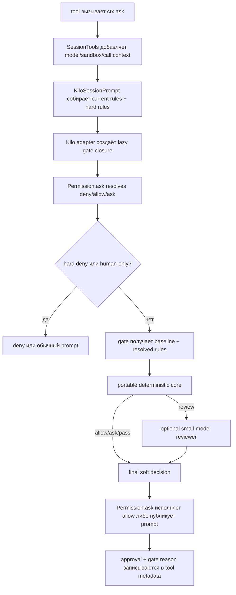

# Практический дизайн security auto mode для Kilo Code

## Статус и границы исследования

- Снимок репозитория: ветка `main`, commit `785b0bcdf7ac765dd29016cc7e8f25f66dc473c1` от 2026-09-02.
- Этот документ продолжает [`SECURITY_AUTO_MODE_RESEARCH.md`](SECURITY_AUTO_MODE_RESEARCH.md) и переводит найденную архитектуру в реалистичный дизайн hackathon MVP.
- Метод: статический разбор текущего кода, тестов и недавней git-истории. Production-код не изменялся.
- Scope: decision logic, Kilo adapter, место вызова, данные для детерминированных правил и опционального LLM reviewer. Benchmark, обучение модели и полноценный product UX не проектируются.

## Краткий вывод

Для hackathon MVP имеет смысл сделать **opt-in soft-decision arbiter** в существующем backend permission pipeline:

- он получает уже нормализованный `Permission` request;
- работает после terminal `deny` и hard rules, но до `permission.asked`;
- может заменить только мягкий результат `allow | ask` на `allow | ask`;
- не может обойти `deny`, config protection, `skillShell` и `sandboxEscalation`;
- при отключённом feature flag полностью сохраняет нынешнее поведение;
- при неопределённости или любой ошибке выбирает `ask`.

Наиболее сильный MVP scope:

1. `bash`, включая отдельную политику для background process;
2. `edit` для `write`, `edit` и `apply_patch`;
3. boundary checks: `external_directory` и чувствительные `read`;
4. ограниченные network actions: `webfetch` и локальный `browser_open`;
5. MCP/delegated actions как консервативная граница `ask`, а не как объект семантической классификации.

Decision logic должна быть **deterministic-first**. LLM полезен только как опциональный reviewer для узкого класса синтаксически простых shell-команд, которые уже прошли детерминированный eligibility filter. LLM не должен напрямую управлять `allow`, видеть историю диалога или быть обязательным для работоспособности режима.

Для MVP portable core лучше разместить в Kilo-owned каталоге `packages/opencode/src/kilocode/permission/decision/`, но сохранить его независимым от Effect, Kilo services и permission schemas. Вынос в отдельный workspace package до появления второго consumer добавит больше packaging overhead, чем реальной переносимости.

## 1. Почему нужен arbiter и для `allow`, и для `ask`

Текущий `Permission.Service.ask` уже является авторитетной точкой решения. Он вычисляет winning rule для каждого pattern, применяет hard veto, config protection и manual-only guards, затем либо возвращает auto-approval, либо публикует prompt ([`permission/index.ts:187-270`](packages/opencode/src/permission/index.ts#L187)).

Если новый слой обрабатывать только после появления `permission.asked`, он:

- не увидит действия, разрешённые default agent rules или YOLO;
- сможет уменьшать prompts, но не сможет сделать широкий `allow` безопаснее;
- окажется client-side approval bot, а не security layer.

Если обрабатывать только baseline `ask`, получится полезный, но узкий smart auto-approver. Более сильный MVP может одинаковым кодом:

- повысить `ask` до `allow` для узкого low-risk действия;
- понизить default/agent/YOLO `allow` до `ask`, если действие выходит за разрешённый envelope;
- вернуть `pass`, если категория не поддерживается или явная пользовательская policy должна остаться главнее.

При этом новый слой не должен вводить собственный `deny` в первой версии. Высокий риск означает «нужен человек», а не «действие навсегда запрещено». Existing `deny` остаётся единственным terminal policy decision.

## 2. Какие actions уже достаточно хорошо описаны

Permission request имеет `permission`, `patterns`, нестрогое `metadata`, `always` и correlation с tool call ([`packages/schema/src/v1/permission.ts:27-59`](packages/schema/src/v1/permission.ts#L27)). Качество контекста сильно зависит от tool.

| Категория | Что уже приходит в permission layer | Качество для MVP | Решение |
|---|---|---|---|
| `bash` | Полная команда, декомпозированные command patterns, heredoc flag; отдельный `external_directory` request | Высокое, но не хватает явной parse completeness и shell/cwd metadata | Основной scope |
| `edit` через `write`/`edit` | Абсолютный path, relative pattern, unified diff и `filediff` с additions/deletions | Высокое | Основной scope |
| `edit` через `apply_patch` | Список файлов, `add/update/delete/move`, patch, additions/deletions, move target | Очень высокое | Основной scope |
| `external_directory` | Glob/path; для file tools — `filepath`/`parentDir`, для shell — command, directories и `access: read` при доказанном чтении | Высокое для boundary decision | Всегда human boundary в MVP |
| `read` | Relative/canonical path patterns; external read отдельно проходит через `external_directory` | Среднее: path известен, содержимое нет | Только deterministic guard |
| `webfetch` | Нормализованный URL, output format и timeout | Высокое для origin/URL policy | Ограниченный deterministic scope |
| `browser_open` | `navigate:<origin>`, operation и URL; сам tool разрешает только loopback HTTP | Высокое | Deterministic allow для local preview |
| background process | `bash` с command, description, `action: start`, `backgroundProcess: true`; external cwd проверяется отдельно | Высокое | Всегда `ask` в MVP |
| MCP/native delegated tool | Permission key и pattern `*`, но `metadata: {}`; raw args остаются рядом в executor | Низкое для semantics | Не auto-approve; оставить `ask` |
| notebook edit/execute | Path, index/revision/action, но не новый cell content или исполняемый code | Низкое для semantic review | Не включать в MVP |
| `task`, Agent Manager, board/memory | Есть product-specific metadata, но effects распределены между orchestration paths | Неоднородное | Не включать в MVP |
| `skillShell`, `sandboxEscalation` | Хорошо помечены специальными metadata flags | Достаточное | Переиспользовать existing human-only guard |

### 2.1. Shell

`ShellPermission` использует tree-sitter, выделяет отдельные commands, path arguments и external directories. Потерянные parser-ом fragments добавляются обратно в patterns, то есть scanner уже fail-closed ([`tool/shell.ts:368-420`](packages/opencode/src/tool/shell.ts#L368)). Permission calls содержат:

- `external_directory`: command, directories, globs, optional `access: "read"`;
- `bash`: normalized command, description, heredoc metadata и command patterns ([`tool/shell.ts:286-323`](packages/opencode/src/tool/shell.ts#L286)).

Для надёжного reviewer не хватает нескольких уже вычисленных, но не переданных полей:

- `parsedComplete`;
- число command nodes;
- `access: read | unknown` и наличие redirection для основного `bash` request;
- shell dialect и cwd;
- факт, что scanner нашёл external paths.

Это оправдывает небольшой metadata-only diff в `shell.ts`. Повторно парсить команду внутри decision core хуже: появится второй parser с отличающейся семантикой.

Background tool не использует этот scanner, но явно ставит `backgroundProcess: true` ([`background-process.ts:160-184`](packages/opencode/src/kilocode/tool/background-process.ts#L160)). Этого достаточно для terminal `ask` в security mode.

### 2.2. File changes

Для обычных `write` и `edit` permission metadata уже содержит diff и `filediff` ([`write.ts:62-73`](packages/opencode/src/tool/write.ts#L62), [`edit.ts:126-141`](packages/opencode/src/tool/edit.ts#L126)). `filediff` несёт file path, patch и счётчики строк; для файлов больше 500 000 characters patch намеренно пустой ([`edit.ts:27-45`](packages/opencode/src/tool/edit.ts#L27)). Пустой patch при крупном файле должен трактоваться как insufficient context, а не как отсутствие изменений.

`apply_patch` даёт ещё более структурированное представление: per-file type, relative/absolute paths, patch, additions/deletions и move target ([`apply_patch.ts:219-241`](packages/opencode/src/tool/apply_patch.ts#L219)).

Этого хватает для детерминированного решения по capability risk без чтения файлов заново и без LLM.

### 2.3. Boundary и network

File tools проверяют выход из worktree отдельным `external_directory` request с точным path ([`external-directory.ts:35-54`](packages/opencode/src/tool/external-directory.ts#L35)). Shell делает аналогичную проверку для найденных paths. Это естественная privacy/host boundary, которую MVP не должен автоматически пересекать даже для read-only access.

`webfetch` передаёт URL, format и timeout ([`webfetch.ts:30-51`](packages/opencode/src/tool/webfetch.ts#L30)). Этого достаточно, чтобы без LLM выделить credentials in URL, literal loopback/private/link-local addresses, unusual ports и malformed host. Это не полная SSRF-защита: DNS rebinding и redirect chain остаются отдельной задачей.

`browser_open` уже ограничен localhost/`127.0.0.1` и передаёт origin-level pattern плюс URL ([`browser-open.ts:94-103`](packages/opencode/src/kilocode/tool/browser-open.ts#L94)). Его можно безопасно использовать как маленький демонстрируемый deterministic allow case.

MCP path сейчас спрашивает permission по имени tool с `patterns: ["*"]` и пустой metadata ([`session/tools.ts:463-493`](packages/opencode/src/session/tools.ts#L463)). До добавления bounded raw args и tool schema LLM reviewer здесь будет в основном угадывать по имени, поэтому MCP semantic auto-approval не входит в MVP.

## 3. Рекомендуемый risk scope

MVP должен контролировать не список известных «атак», а пять стабильных effect classes:

1. **Host execution** — запуск процессов и shell syntax с возможными побочными эффектами.
2. **Workspace mutation** — добавление/изменение/удаление/перемещение файлов.
3. **Boundary crossing** — чтение или запись за пределами текущего workspace/worktree.
4. **Persistence/delegation** — background processes, MCP и другие long-lived или externally delegated effects.
5. **Ambiguity** — неполный parse, отсутствующая metadata, oversized/truncated diff или неизвестная action shape.

Приоритет первой версии:

- разрешать bounded, хорошо описанные действия внутри workspace;
- сохранять human approval для host/external/persistent effects;
- сохранять prompt для действий, для которых Kilo не передал достаточного контекста;
- использовать sandbox status как дополнительный positive signal, но не как замену permission decision;
- не пытаться определить, «правильный ли код» пишет агент.

Не входят в security claim MVP:

- semantic correctness сгенерированного кода;
- tracking данных от sensitive read до последующего network call;
- malicious in-process plugin, который вообще не вызывает `ctx.ask`;
- каждый direct execution path вне выбранных permissions;
- полноценная SSRF, supply-chain и secret-scanning система.

## 4. Decision precedence

Current permission semantics уже имеют несколько уровней. Новый arbiter должен быть встроен между existing guards и созданием pending prompt, а не заменять их.

Рекомендуемый порядок:

| Приоритет | Условие | Результат |
|---|---|---|
| 1 | Hard ruleset veto | `deny`, gate не вызывается |
| 2 | Winning permission rule — `deny` | `deny`, gate не вызывается |
| 3 | `skillShell`, `sandboxEscalation`, protected config без trusted exception | `ask`, gate не может повысить до allow |
| 4 | Явная project/global/session policy | Сохранить baseline decision |
| 5 | Catch-all agent default, default fallback или YOLO/broad auto mode | Передать soft `allow | ask` в gate |
| 6 | Gate `allow` | Выполнить без prompt, записать provenance |
| 7 | Gate `ask`, uncertainty или error | Создать обычный `permission.asked` |
| 8 | Gate `pass` | Использовать baseline Kilo decision |

Почему стоит уважать явную пользовательскую policy:

- `project`, `global` и точные session rules — это уже выраженное решение пользователя, а не default;
- security auto mode не должен тайно отменять explicit `ask` или exact persisted `allow`;
- broad YOLO можно отличить от обычного session rule и пропустить через gate.

Kilo уже помечает runtime rules источниками `agent | global | project | yolo | session`, а winning rule проходит через `Permission.resolve` без копирования ([`provenance.ts:11-34`](packages/opencode/src/kilocode/permission/provenance.ts#L11), [`provenance.ts:67-81`](packages/opencode/src/kilocode/permission/provenance.ts#L67)). Это позволяет не изобретать новый origin tracker.

Specific agent allow rules можно сохранить как совместимый Kilo seed, но catch-all agent rules (`bash: * ask`, generic edit/read allow) должны оставаться gateable. Так MVP не переписывает зрелую command allowlist, но контролирует широкие defaults.

Если origin не удаётся доказать:

- untagged `allow` разумно считать explicit и вернуть `pass`;
- fallback `ask` без rule source можно считать gateable;
- отсутствие action metadata внутри поддерживаемой категории означает `ask`.

## 5. Deterministic policy MVP

### 5.1. Общий принцип

Детерминированная policy должна быть allowlist-oriented:

- `allow` только при доказанном совпадении со строго ограниченным envelope;
- `ask` при любом boundary, persistence или ambiguity signal;
- `pass` для неподдерживаемой категории или более авторитетной explicit policy.

Gate оценивает весь permission request, а не каждый pattern независимо. Для multi-pattern request `allow` возможен только если все targets удовлетворяют policy.

### 5.2. `edit`

Практичный начальный envelope:

- path находится внутри worktree;
- есть валидная structured metadata;
- только `add` или `update`;
- не более 3 файлов;
- не более 200 changed lines суммарно;
- сериализованный diff не больше 32 KiB;
- patch не пустой из-за oversized input;
- path не попал под existing Kilo config protection или явно заданный MVP control-path rule.

Такое действие можно `allow`. Следует `ask`, если:

- есть `delete` или `move`;
- metadata shape неизвестна;
- diff отсутствует, усечён или слишком велик;
- targets смешивают internal и external paths;
- request уже помечен existing config protection.

Пороговые значения — не security guarantees, а прозрачные policy constants для первой версии. Они должны быть централизованы в core и покрыты table-driven tests.

LLM для обычных edits в MVP не нужен. Capability decision уже можно принять по path, operation и размеру. Semantic diff review — отдельный opt-in extension, который увеличит privacy surface и latency.

### 5.3. `bash`

Сначала переиспользуется текущая permission classification:

- specific allow из Kilo `readable`/bash defaults остаётся allow;
- existing deny остаётся terminal;
- catch-all agent `ask` становится кандидатом для gate;
- YOLO `allow` больше не означает автоматический allow для неизвестной команды.

Немедленный `ask`:

- `backgroundProcess: true`;
- heredoc;
- неполный parse;
- несколько command nodes, pipeline, redirection, command/process substitution или другой compound shell syntax;
- найденные external paths;
- пустая или чрезмерно длинная команда;
- неизвестный shell dialect;
- команда требует sandbox escalation;
- недостаточно metadata, чтобы доказать ограничения.

Deterministic `allow` сверх существующих правил имеет смысл только для узкого набора простых developer actions, например test/typecheck/lint/check, если одновременно:

- команда — один простой invocation без shell composition;
- cwd внутри worktree;
- sandbox реально `enabled` и `available`;
- для команд, которые могут скачивать зависимости или обращаться к registry, network действительно restricted;
- command family и разрешённые subcommands заданы allowlist-ом.

Важно: `npm test`, `bun run test`, `pytest` и аналоги исполняют project code. Без работающего sandbox LLM не превращает это исполнение в безопасное. Поэтому deterministic mode без sandbox должен оставить такие команды на `ask`.

### 5.4. `external_directory` и `read`

В MVP любой новый `external_directory` boundary остаётся `ask`, включая доказанное read-only access. Причина — confidentiality: read-only для файловой системы не означает безвредность для пользователя.

После одобрения boundary последующий `edit` request не следует автоматически запрещать второй раз. Самый простой вариант — вернуть для outside-workspace `edit` результат `pass` и оставить текущую edit rule семантику. Более строгий future вариант — передавать per-call факт успешного boundary approval через общий `callID`.

Обычный internal `read` не нуждается в дополнительном reviewer. Но gate должен сохранить existing sensitive-path asks, в частности `.env`/`.env.*`, даже если включён broad YOLO. Existing defaults уже формируют эти rules ([`agent/agent.ts:128-163`](packages/opencode/src/agent/agent.ts#L128)). `Permission.ask` может передать gate-у одновременно base rule, вычисленное без saved/session overrides, и итоговое resolved rule. Тогда core увидит, что YOLO перекрыл specific base `ask`, не заводя второй secret detector.

### 5.5. `webfetch` и `browser_open`

Для `webfetch` deterministic `allow` допустим только для корректного public `http/https` URL без embedded credentials, literal local/private/link-local address и unexpected port. Всё неоднозначное — `ask`.

Это не следует объявлять полной SSRF-защитой. Redirect policy, DNS resolution/rebinding и provider-level proxy controls остаются за пределами permission core.

`browser_open` можно `allow`, если adapter подтвердил уже существующее ограничение на loopback HTTP origin. Это хороший demo case: metadata полная, effect понятен, LLM не нужен.

### 5.6. MCP, notebooks и orchestration tools

В security auto mode MCP/native delegated action без arguments metadata должен остаться `ask`, если нет explicit user allow. Это не «неподдерживаемый bypass», а сознательная conservative boundary.

Notebook execute/edit тоже остаются `ask`: текущая metadata знает cell index и revision, но не код или новое содержимое cell ([`notebook-host.ts:150-220`](packages/opencode/src/kilocode/tool/notebook-host.ts#L150)).

`task`, Agent Manager, board и memory tools не включаются в первую версию. Их risk зависит от child-session inheritance и product-specific state, а не только от одного permission request.

## 6. Где LLM действительно полезен

### 6.1. Сравнение вариантов

| Вариант | Плюсы | Минусы | Вердикт |
|---|---|---|---|
| Только deterministic core | Предсказуемость, быстрые tests, нет provider/privacy dependency | Меньше coverage для неизвестных shell commands | Полноценный минимальный MVP |
| Deterministic core + узкий LLM reviewer | Больше safe shell coverage, сильнее hackathon demo | Latency, cost, model uncertainty, нужен fail-closed orchestration | Рекомендуемый optional mode |
| LLM-first для каждого action | Мало rule code | Нестабильность, prompt injection, высокая цена, плохая объяснимость | Не использовать |
| LLM для всех diffs и MCP args | Богатый semantic context | Privacy surface и большой integration scope | После MVP |

Наиболее полезная роль LLM в первой версии — **классифицировать один синтаксически простой shell invocation внутри уже заданного deterministic envelope**. Он может различать обычную проверку, build/test action и invocation с удалённым или persistent effect, но не должен анализировать произвольный shell program.

### 6.2. Контекст reviewer

Передавать:

- canonical action kind и permission;
- normalized command с жёстким byte limit;
- parsed command count и parse completeness;
- command patterns;
- cwd relation: inside/outside worktree, без лишнего absolute path при возможности;
- shell dialect/platform;
- `background`, `heredoc`, external-path и redirection flags;
- sandbox `{enabled, available, networkRestricted}`;
- baseline action и origin (`agent/default/yolo`);
- untrusted tool description как необязательную подсказку, явно помеченную как untrusted.

Не передавать:

- историю чата, system prompt и hidden reasoning;
- полный environment или значения secrets;
- содержимое файлов и произвольный project context;
- невалидированную permission `metadata` целиком;
- source diff по умолчанию;
- raw MCP arguments до появления специального bounded adapter.

Для package scripts reviewer не знает фактическую expansion из `package.json`. Он не должен считать `npm run <name>` безопасным только по имени. Либо такой command остаётся `ask`, либо adapter в будущем явно передаёт bounded resolved script вместе с sandbox guarantee.

### 6.3. Reviewer output и uncertainty

LLM не возвращает финальный permission action. Он возвращает строго валидируемую рекомендацию, например:

```ts
type Review = {
  label: "low_risk" | "needs_human"
  category: "read_only" | "local_dev" | "remote_effect" | "persistent_effect" | "unknown"
  reason: string
  confidence: number
}
```

Decision core преобразует `low_risk` в `allow` только если deterministic eligibility всё ещё выполнен. `confidence` — diagnostic signal, а не самостоятельное основание разрешения.

Любое из следующего даёт `ask`:

- small model не найден;
- timeout;
- provider/network error;
- invalid structured output;
- `needs_human`, `unknown` или confidence ниже policy threshold;
- несовпадение ответа с deterministic features;
- отмена tool call.

Reviewer call должен иметь:

- no tools;
- structured output schema;
- temperature около нуля;
- `maxRetries: 0` или максимум один bounded retry;
- короткий timeout порядка 2–3 секунд;
- отдельную system instruction, что command/description являются hostile data, а не инструкциями.

### 6.4. Почему не использовать `LLM.Service`

`LLM.Service` уже зависит от `Permission.Service` ([`session/llm.ts:76-97`](packages/opencode/src/session/llm.ts#L76)). Если `Permission.Service` начнёт зависеть от `LLM.Service`, получится layer cycle.

Существующий код уже показывает подходящий паттерн:

- `Provider.getSmallModel(providerID)` выбирает configured/provider-specific small model и Kilo fallback ([`provider/provider.ts:1989-2071`](packages/opencode/src/provider/provider.ts#L1989));
- `enhance-prompt.ts` вызывает AI SDK напрямую через `Provider.Service`, без agent loop и tools ([`enhance-prompt.ts:27-47`](packages/opencode/src/kilocode/enhance-prompt.ts#L27));
- `Agent.generate` использует `generateObject` со structured schema ([`agent/agent.ts:538-598`](packages/opencode/src/agent/agent.ts#L538)).

Reviewer должен повторить этот bounded direct-call pattern: `Provider.Service` + `getSmallModel` + `generateObject`, но не `LLM.Service`.

## 7. Portable decision core

### 7.1. Каноническая модель

Core не должен импортировать `Permission`, Effect, Provider, Session или filesystem services. Пример границы:

```ts
type Baseline = {
  action: "allow" | "ask"
  origin: "agent" | "default" | "yolo" | "project" | "global" | "session" | "unknown"
}

type Environment = {
  platform: "windows" | "macos" | "linux" | "other"
  workspace: string
  sandbox: {
    enabled: boolean
    available: boolean
    networkRestricted: boolean
  }
}

type Action =
  | ShellAction
  | EditAction
  | ExternalAction
  | ReadAction
  | NetworkAction
  | DelegatedAction
  | UnknownAction

type Plan = {
  next: "allow" | "ask" | "review" | "pass"
  code: string
  risk: "low" | "medium" | "high" | "unknown"
  evidence: string[]
  policy: string
}

type Decision = Omit<Plan, "next"> & {
  effect: "allow" | "ask" | "pass"
  via: "rule" | "reviewer" | "fallback"
  confidence?: number
}
```

`Action` содержит только нормализованные данные. Kilo-specific loose metadata не должна проникать в rules.

### 7.2. Размещение

Для MVP:

```text
packages/opencode/src/kilocode/permission/decision/
  model.ts       # portable data types and reason codes
  core.ts        # pure deterministic policy
  adapter.ts     # Permission request -> canonical Action
  reviewer.ts    # optional Provider-backed reviewer
  service.ts     # deterministic/reviewer orchestration and fail-closed fallback
```

`core.ts` и `model.ts` должны использовать только TypeScript standard library. Тогда их можно позже механически перенести в `packages/kilo-security` или отдельный repository.

Новый workspace package в hackathon MVP не рекомендуется:

- пока есть только один consumer;
- добавятся package manifest, build graph и release/changeset вопросы;
- переносимость определяется dependency boundary, а не физическим package с первого дня.

### 7.3. Reason codes

Reason должен быть machine-readable и стабильным, например:

- `edit.bounded_workspace_update`;
- `edit.delete_or_move`;
- `shell.simple_sandboxed_dev`;
- `shell.compound_or_unparsed`;
- `shell.reviewer_low_risk`;
- `external.human_boundary`;
- `network.private_or_ambiguous`;
- `delegated.missing_arguments`;
- `fallback.reviewer_error`.

Human-readable explanation можно формировать отдельно. Не следует хранить свободный LLM rationale как policy fact.

## 8. Kilo adapter и точка интеграции

### 8.1. Lazy decision hook

Лучший code-level компромисс — передать в Kilo-расширенный `Permission.AskInput` **lazy runtime-only hook**, а не внедрять Provider service внутрь Permission layer:

```ts
type GateInput = {
  baseline: "allow" | "ask"
  targets: Array<{
    pattern: string
    base: Permission.Rule
    resolved: Permission.Rule
  }>
}

type Gate = (input: GateInput) => Effect.Effect<Decision, never>

type AskInput = PermissionV1.AskInput & {
  hardRuleset?: Permission.Ruleset
  gate?: Gate
}
```

Hook создаётся в Kilo adapter и захватывает уже полученный `DecisionService` interface. `Permission.ask` вызывает его только после того, как вычислил current base rules, saved/session overrides, hard veto и manual-only conditions. Base и resolved rule считаются существующим `Permission.resolve`, а не новым rule engine.

Преимущества:

- Permission остаётся authoritative enforcement point;
- reviewer не вызывается для terminal deny, saved explicit decision или force-ask;
- нет `Permission -> Provider/LLM` dependency и layer cycle;
- hook, model reference и raw runtime context не попадают в public `Permission.Request`/events;
- feature off означает отсутствие hook и неизменный control flow.

### 8.2. Изменение `Permission.ask`

Текущий код уже собирает `needsAsk` и `approvedRule`, после чего сразу возвращает auto-approval на строке 244 ([`permission/index.ts:194-250`](packages/opencode/src/permission/index.ts#L194)). Минимальный будущий refactor:

```ts
const { ruleset, hardRuleset, gate, ...request } = input
const targets: GateInput["targets"] = []
let baseline: "allow" | "ask" = "allow"
let locked = false

for (const pattern of request.patterns) {
  const base = resolve(permission, pattern, ruleset)
  const rule = resolve(...)
  targets.push({ pattern, base, resolved: rule })

  if (hardVeto) return deny()
  if (rule.action === "deny") return deny()
  if (forceAsk || protectedConfig) {
    locked = true
    baseline = "ask"
    continue
  }
  if (rule.action === "ask") baseline = "ask"
}

if (!locked && gate) {
  const decision = yield* gate({ baseline, targets }).pipe(failClosedToAsk)
  if (decision.effect === "allow") return autoApproved(decision)
  if (decision.effect === "ask") baseline = "ask"
}

if (baseline === "allow") return currentAutoApproval()
return currentPendingFlow()
```

Это псевдокод, а не предложение переписать весь function. В реальном diff следует сохранить текущую структуру и добавить один ограниченный Kilo-marked block перед `if (!needsAsk)`, чтобы уменьшить upstream conflicts.

Gate вызывается один раз на permission request, а не на каждый pattern. Если один target рискован или неизвестен, весь request становится `ask`.

### 8.3. Где создаётся hook

`SessionTools.resolve` уже имеет:

- current model;
- `Permission.Service`;
- `RuntimeFlags.Service`;
- фактический `sandboxed` status и network restriction;
- `messageID`, `callID`, agent и session ([`session/tools.ts:50-102`](packages/opencode/src/session/tools.ts#L50)).

Он же уже передаёт request в `KiloSessionPrompt.askPermission` и записывает approval provenance в tool metadata ([`session/tools.ts:112-165`](packages/opencode/src/session/tools.ts#L112)).

Рекомендуемый flow:



`KiloSessionPrompt.askPermission` — подходящее место для сборки hook, потому что именно здесь current agent/session config перечитывается непосредственно перед decision ([`kilocode/session/prompt.ts:353-375`](packages/opencode/src/kilocode/session/prompt.ts#L353)).

### 8.4. Sandbox context

`SandboxPolicy.status` возвращает `enabled` только если backend действительно available ([`sandbox/policy.ts:339-348`](packages/opencode/src/kilocode/sandbox/policy.ts#L339)). `networkRestricted` отдельно проверяет stored mode ([`sandbox/policy.ts:351-354`](packages/opencode/src/kilocode/sandbox/policy.ts#L351)).

Gate должен получать оба значения и считать containment доказанным только при `status.enabled === true`. Нельзя использовать один `networkRestricted`: stored sandbox может быть включён при unavailable platform backend.

На Windows текущий sandbox backend недоступен. Поэтому containment-dependent shell auto-approval на Windows должен превращаться в `ask`; Windows demo может показывать edit/path/network decisions, но не заявлять OS sandbox guarantee.

## 9. Provenance и audit без нового API

`Permission.ask` уже возвращает internal `AskOutcome {manual, rule}`, а `KiloSessionPrompt` классифицирует его и записывает `approval` в произвольную tool metadata ([`permission/index.ts:66-76`](packages/opencode/src/permission/index.ts#L66), [`kilocode/session/prompt.ts:372-375`](packages/opencode/src/kilocode/session/prompt.ts#L372)). `kilo-ui` безопасно читает только известные поля и игнорирует дополнительные ([`tool-approval.tsx:59-101`](packages/kilo-ui/src/components/tool-approval.tsx#L59)).

Для MVP достаточно расширить internal outcome/provenance:

```ts
type GateAudit = {
  mode: "deterministic" | "hybrid"
  via: "rule" | "reviewer" | "fallback"
  code: string
  policy: string
  confidence?: number
}

type Approval = ExistingApproval & {
  gate?: GateAudit
}
```

При gate auto-approval можно вернуть synthetic exact allow rule с runtime source `session`. Existing UI тогда уже показывает «session auto-approve rule», а JSON/session export дополнительно содержит точный `gate.code`.

Это не требует:

- изменения public permission schema;
- SDK regeneration;
- нового server endpoint;
- новой source enum и переводов во всех клиентах.

После MVP стоит добавить отдельный UI source `security` и human-readable reason. Для работающего backend prototype это не обязательно.

Автоматическое решение не должно сохраняться как global `always` rule. Existing `once/always/reject` остаются только результатом реального human reply. Кэш reviewer-а также не нужен в первой версии; Kilo уже имеет session/global rule mechanisms, а скрытый cache усложнит invalidation и объяснимость.

## 10. Что переиспользовать из Kilo

| Existing mechanism | Как использовать |
|---|---|
| `Permission.resolve` и wildcard precedence | Не писать второй rule engine |
| `hardRuleset` | Terminal deny для Ask/Plan/read-only modes |
| `ConfigProtection.isRequest` | Не дублировать Kilo config/skill path policy |
| `skillShell` / `sandboxEscalation` + `interactive` reply | Готовый human-only pattern |
| Shell tree-sitter scanner и fail-closed `unparsed` recovery | Единственный источник shell decomposition |
| `readable`, `bash`, `readOnlyBash` agent defaults | Seed для known-safe/known-ask commands |
| `PermissionProvenance` runtime source tags | Отличать default/agent/YOLO от explicit user policy |
| `Tool.Context.tool` IDs и `callID` | Correlation и future cross-request history |
| File `filediff`/`files` metadata | Не читать и не diff-ить файлы повторно |
| `SandboxPolicy.status/networkRestricted` | Positive containment features, не самостоятельное решение |
| `Provider.getSmallModel` + direct `generateObject` | Bounded reviewer без agent tools и layer cycle |
| Existing `permission.asked`/reply flow | Human fallback без нового UI channel |
| Arbitrary tool metadata + approval display | Audit trail без schema/API changes |

Недавние изменения особенно полезны как precedents:

- shared bash permissions (`e096d3ab77`, 2026-09-01);
- plan-mode ruleset dedupe (`62998965e9`, 2026-08-27);
- hard read-only mode protection (`d4f3a3a9e6`, 2026-08-18);
- sandbox git escalation (`86af8dd7c7`, 2026-08-17);
- approval/denial provenance и UI explanation (серия июля–августа 2026).

Отдельного security gatekeeper/risk classifier в текущем tree и доступной истории не найдено. `PermissionProvenance.classify` объясняет уже принятое решение и не заменяет proposed core.

## 11. Минимальный набор будущих изменений

### 11.1. Обязательный deterministic MVP

1. Добавить pure `model.ts`/`core.ts` и Kilo adapter в `src/kilocode/permission/decision/`.
2. Передать из shell scanner `parsedComplete`, command count, access, redirects, cwd relation и shell dialect.
3. Добавить opt-in runtime flag, например `KILO_EXPERIMENTAL_SECURITY_AUTO_MODE`; использовать runtime flags, а не новый public `Config.Info`, чтобы не затрагивать cloud schema.
4. В `KiloSessionPrompt.askPermission` создать lazy gate hook для поддерживаемых actions.
5. В `Permission.AskInput` принять runtime-only hook и применить его после existing terminal guards, до auto-return/pending event.
6. Передать из `SessionTools` model/sandbox/cancellation context.
7. Добавить gate audit в existing permission provenance/tool metadata.
8. Написать pure policy tests и Permission integration tests.

### 11.2. Дополнение для hybrid mode

1. Добавить Provider-backed reviewer с structured output и timeout.
2. Добавить failure-path tests: no model, timeout, invalid response, interruption.

### 11.3. Что не нужно для finished MVP

- отдельный npm/workspace package;
- новый permission endpoint или SDK schema;
- изменение VS Code/JetBrains/TUI approval protocol;
- custom client approval bot;
- raw MCP argument plumbing;
- history/taint database;
- policy learning from user replies;
- benchmark harness;
- полноценный settings UI.

## 12. Тестовая стратегия

### Pure core

Table-driven tests без mocks:

- bounded single-file update → `allow`;
- delete/move/oversized/missing diff → `ask`;
- simple sandboxed developer command → `allow` или `review`;
- compound/unparsed/heredoc/background shell → `ask`;
- external directory → `ask`;
- public URL → `allow`, local/private/credential URL → `ask`;
- unsupported/MCP without args → `ask` или `pass` согласно explicit policy;
- multi-pattern request: один unknown target делает весь request `ask`.

### Permission integration

Расширить существующие seams в `packages/opencode/test/permission/next.test.ts` и `packages/opencode/test/kilocode/permission/`:

- hard deny нельзя повысить hook-ом;
- explicit deny terminal;
- `skillShell`, `sandboxEscalation` и config-protected request нельзя auto-approve;
- gate `allow` обходит prompt только для soft decision;
- gate `ask` публикует обычный request;
- gate `pass` полностью сохраняет baseline;
- gate error в enabled mode fail-closed to `ask`;
- feature off сохраняет current outcomes;
- auto-decision не создаёт persistent always rule;
- source/reason сохраняются в tool metadata.

### Reviewer

CI не должен зависеть от remote model. Отдельно тестируются:

- prompt/context builder;
- output schema decoder;
- mapping `Review -> Decision`;
- timeout/error fallback через bounded test implementation interface;
- hostile command/description остаются data и не расширяют deterministic eligibility.

## 13. Finished demo definition

Прототип уже можно считать законченным, если он демонстрирует один и тот же backend behavior в CLI/headless и extension client:

1. Feature flag выключен — Kilo ведёт себя как до изменений.
2. Обычный небольшой workspace edit, разрешённый agent default, проходит без prompt и получает gate reason.
3. Большой/delete/move edit переводится в prompt.
4. Простой sandboxed test/typecheck invocation проходит deterministic или hybrid review.
5. Compound shell, background process и external directory остаются manual.
6. Private/local ambiguous `webfetch` остаётся manual, local `browser_open` проходит.
7. MCP без arguments metadata остаётся manual.
8. Existing deny, hard read-only mode, config protection, `skillShell` и `sandboxEscalation` невозможно обойти.
9. Reviewer outage/timeout превращается в prompt, а не в silent allow.
10. JSON/tool metadata показывает policy version, reason code и источник решения.

Это демонстрирует снижение approval fatigue без blanket allow и одновременно показывает, что режим может сузить broad YOLO/default allow.

## 14. Существенные ограничения

### Loose metadata contract

`Record<string, unknown>` позволяет быстро прототипировать, но требует строгого validation adapter. Core не должен делать unchecked casts. После MVP полезно ввести per-permission discriminated schemas.

### Coverage зависит от `ctx.ask`

Gate контролирует существующие permission requests, а не каждый вызов tool. Plugin/custom tool может не вызвать `ctx.ask`; direct execution paths тоже требуют отдельного inventory. Это не мешает заявленному MVP scope, но ограничение должно быть явным.

### Несколько requests на один tool call

Shell/file tool может сначала спросить `external_directory`, затем `bash`/`edit`. `callID` позволяет в будущем строить action aggregate, но MVP принимает решения отдельно и не делает cross-request dataflow.

### Sandbox не универсален

Sandbox — independent containment layer, disabled by default и platform-dependent. Reviewer не должен выдавать sandbox-backed allow, если `status.enabled` false. Windows gap особенно важен для демонстрации.

### LLM не является security boundary

Command text может содержать prompt injection; self-reported confidence плохо калиброван; model/provider может быть недоступен. Без deterministic envelope LLM-first режим будет вариантом unsafe allow-by-guessing.

### Fork/upstream pressure

Новая логика должна жить в Kilo-owned каталоге. Shared OpenCode diff следует ограничить:

- одним optional hook field;
- одним небольшим hook invocation block в `Permission.ask`;
- минимальным metadata enrichment в `shell.ts`;
- `kilocode_change` markers и Kilo-owned tests.

## 15. Рекомендуемые архитектурные направления

### Направление 1 — рекомендуемое для hackathon

**Deterministic-first soft-decision arbiter с опциональным shell LLM reviewer.**

Почему это лучший баланс:

- использует самую авторитетную существующую точку без client middleware;
- одновременно уменьшает `ask` и ограничивает default/YOLO `allow`;
- покрывает основные capability classes реальными Kilo metadata;
- сохраняет human-only и hard security guards;
- остаётся полезным без модели и при model outage;
- не требует API/SDK/UI redesign;
- легко тестируется pure matrices и existing Permission tests;
- Kilo-specific code почти целиком остаётся вне shared upstream paths.

Для самого короткого срока можно завершить deterministic mode первым. Hybrid flag добавляет reviewer, не меняя core или enforcement semantics.

### Направление 2 — следующий upstream-friendly шаг

**Обобщить lazy hook в нейтральный `PermissionDecisionHook` contract и предложить upstream только extension point, оставив policy в Kilo.**

Это разумно после работающего MVP, когда станут стабильны:

- входной canonical action schema;
- precedence с explicit rules и `always`;
- reason/audit model;
- поведение для multi-pattern requests.

Upstream PR тогда будет маленьким и policy-agnostic: optional hook получает resolved soft decision и может вернуть `allow | ask | pass`. Kilo adapter, deterministic rules и reviewer останутся в `src/kilocode/`.

Сразу начинать с generic upstream abstraction не стоит: без проверенного consumer высок риск зафиксировать неправильный contract и потратить hackathon на plumbing.

## Итоговый выбор

Начинать реализацию следует с направления 1 в двух независимых слоях:

1. pure deterministic core + Kilo metadata adapter;
2. lazy authoritative hook в `Permission.ask`, с optional Provider-backed reviewer поверх core.

Первый реально полезный implementation slice: `edit` + `bash` + fixed human boundaries (`external_directory`, sensitive read, background, MCP) и deterministic URL/local-preview policy. Этого достаточно для законченного прототипа. Notebook semantics, raw MCP args, full tool preflight, action history и отдельный UI reason разумно оставить следующими этапами.
