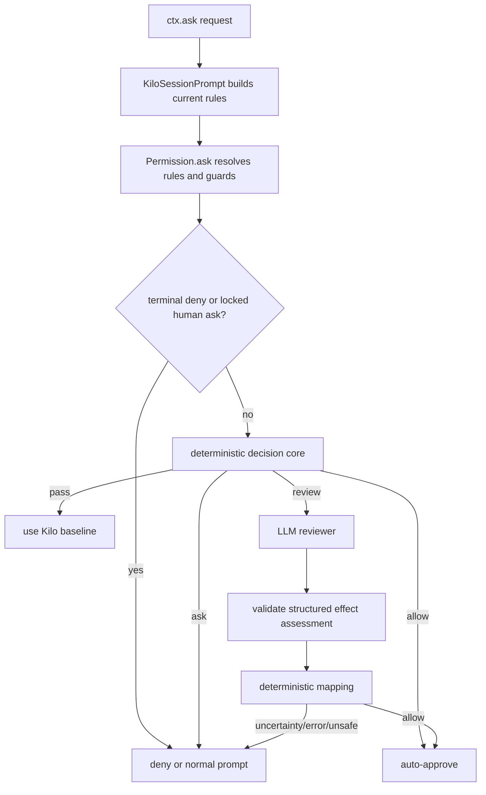

# Роль LLM reviewer в security auto mode Kilo Code

## Статус и границы исследования

- Снимок репозитория: ветка `main`, commit `785b0bcdf7ac765dd29016cc7e8f25f66dc473c1` от 2026-09-02.
- Документ продолжает [`SECURITY_AUTO_MODE_RESEARCH.md`](SECURITY_AUTO_MODE_RESEARCH.md) и [`SECURITY_AUTO_MODE_IMPLEMENTATION_RESEARCH.md`](SECURITY_AUTO_MODE_IMPLEMENTATION_RESEARCH.md).
- Метод: статический разбор текущего permission flow, permission metadata, provider/model routing и существующих LLM call patterns.
- Scope: практическая роль reviewer-а в снижении approval fatigue. Benchmark, обучение classifier-а и product UX не проектируются.
- Production-код не изменялся.

## Краткий вывод

LLM reviewer не должен получать все `ask` и не должен быть главным policy engine. Наиболее целесообразная роль в hackathon MVP — **tail reviewer для узкого класса обычных shell-команд**, которые:

- дошли до мягкого `bash: ask` из agent default, а не из explicit user/project policy;
- не попали под deterministic allow или deterministic human boundary;
- состоят из одного полностью распарсенного invocation;
- не содержат shell composition, heredoc, background execution, external paths или credential-like arguments;
- имеют достаточно runtime context для bounded effect classification.

Оптимальный pipeline:

1. Kilo применяет existing rules, hard denies и human-only guards.
2. Deterministic core принимает очевидные `allow`/`ask` решения.
3. Только результат `review` вызывает small-model reviewer.
4. Reviewer возвращает structured effect assessment, а не `allow`.
5. Deterministic policy преобразует assessment в `allow` или `ask`.
6. Timeout, uncertainty, invalid output и provider error дают обычный human prompt.

Для MVP reviewer стоит ограничить `bash`. `edit` имеет богатый diff context, но в обычном Build agent уже разрешён и поэтому почти не создаёт текущую approval fatigue. `external_directory`, sensitive reads, recall/memory, MCP, notebooks, background processes и orchestration actions либо являются пользовательской boundary, либо не несут нужного контекста, либо хорошо решаются без LLM.

Наибольший эффект reviewer даст на macOS/Linux с работающим sandbox: тогда можно auto-approve больше local test/build/lint commands без перехода к blanket allow. На Windows текущий sandbox недоступен, поэтому безопасный shell coverage будет уже; это ограничение нельзя компенсировать уверенностью модели.

## 1. Где в текущем Kilo возникают `ask`

Это не измеренная telemetry частоты prompts, а структурная оценка current defaults.

Базовый agent ruleset начинается с `* = allow`, но отдельно спрашивает `doom_loop`, `external_directory` и `.env` reads ([`agent/agent.ts:128-159`](packages/opencode/src/agent/agent.ts#L128)). Kilo добавляет:

- `bash: * = ask` и specific allowlist commands;
- `recall = ask`;
- native notebook permissions в VS Code;
- `browser_open = ask` в VS Code;
- memory permissions;
- per-server MCP wildcard asks ([`kilocode/agent/index.ts:23-67`](packages/opencode/src/kilocode/agent/index.ts#L23), [`kilocode/agent/index.ts:340-368`](packages/opencode/src/kilocode/agent/index.ts#L340)).

Из этого следует, что `bash` — самый широкий default ask class. Остальные asks более специализированы и часто выражают именно human boundary.

| Permission/category | Почему возникает ask | Вероятный вклад в fatigue | Ценность LLM reviewer |
|---|---|---|---|
| `bash` catch-all | Команда не попала в current allowlist | Высокий по ширине класса | Высокая для filtered subset |
| `external_directory` | Новый filesystem boundary | Зависит от задачи | Низкая: модель не знает согласия пользователя |
| `.env`/sensitive `read` | Confidentiality boundary | Обычно низкий | Низкая: сохранить human ask |
| `doom_loop` | Повторяющийся tool call | Редкий | Низкая: это UX/control signal |
| MCP server tools | Per-server wildcard defaults | Может быть высоким при MCP-heavy работе | Сейчас низкая: args не доходят в permission metadata |
| notebook read/edit/execute | Native notebook feature | Зависит от workflow | Низкая: edit/code content отсутствует в request |
| `browser_open` | Local preview navigation | Умеренный в frontend workflow | LLM не нужен, достаточно deterministic origin rule |
| `recall`/memory | Cross-session/project data | Зависит от использования | Низкая: privacy/retention policy, не command semantics |
| workflow tool approval | Delegated GitLab workflow tools | Нишевый, но batch | Не для MVP: отдельный path и delegated authority |
| Explicit project/global `ask` | Пользователь сознательно запросил prompt | Любой | Не review: уважать explicit policy |

`board_read`/`board_post` при включённом shared board уже получают default `allow`, а не `ask` ([`kilocode/agent/index.ts:135-137`](packages/opencode/src/kilocode/agent/index.ts#L135)). `repo_clone` в base defaults запрещён, поэтому reviewer не должен пытаться превратить его в allow ([`agent/agent.ts:143-151`](packages/opencode/src/agent/agent.ts#L143)).

## 2. Рассмотренные роли reviewer-а

### Вариант A. Review каждого `permission.asked`

Плюсы:

- очень простой mental model;
- не требуется предварительная классификация категорий;
- легко показать в demo как approval bot.

Минусы:

- reviewer увидит request только после того, как Kilo уже решил показать prompt;
- каждое deterministic или human-boundary решение получит лишний model roundtrip;
- `ask` от explicit user policy может быть автоматически отменён;
- MCP/notebook requests часто не содержат данных для разумного решения;
- модель будет тратить время на очевидные high-risk actions, которые всё равно должны остаться human;
- client/event middleware не видит auto-allowed path и не является backend policy boundary.

Итог: не использовать.

### Вариант B. Reviewer всех soft `ask` внутри `Permission.ask`

Плюсы:

- backend-authoritative;
- terminal deny и hard rules можно применить раньше;
- единое поведение всех клиентов.

Минусы:

- categories остаются слишком разными;
- high-risk/privacy asks всё ещё получают бесполезный latency;
- loose `metadata` потребует большого набора adapters;
- reviewer станет обязательной частью hot path.

Итог: архитектурно лучше A, но scope всё ещё слишком широкий для MVP.

### Вариант C. Deterministic routing + shell-only reviewer

Плюсы:

- атакует самый широкий default ask class;
- command и decomposed patterns уже доступны;
- small prompt и bounded output;
- не требует chat history, file reads или raw MCP plumbing;
- model outage затрагивает только reviewable subset;
- большая часть logic и tests остаётся Kilo-owned.

Минусы:

- LLM coverage ограничен;
- shell command не раскрывает semantics custom scripts;
- project-code execution безопасно расширяется только при working sandbox;
- понадобится небольшое enrichment shell metadata.

Итог: рекомендуемый вариант.

### Вариант D. Shell + edit diff reviewer

Плюсы:

- file tools уже передают rich diff metadata;
- reviewer может различать normal refactor и control-plane/security-sensitive edit;
- полезно, если deterministic security gate начнёт понижать некоторые default edit allows до asks.

Минусы:

- current Build agent обычно не спрашивает обычный `edit`, поэтому немедленное снижение fatigue небольшое;
- diff намного больше shell prompt;
- source code может уйти другому provider-у через `small_model` routing;
- code/diff сам является prompt-injection surface;
- потребуются truncation, redaction и multi-file aggregation policy.

Итог: возможный второй этап, не hackathon MVP.

## 3. Точная точка подключения

### 3.1. Почему не `permission.asked` event

Event появляется только после того, как `Permission.ask` решил, что нужен человек. Reviewer на event level:

- не может участвовать в общей precedence;
- требует client/reply automation;
- хуже отличает hard ask от обычного soft ask;
- дублирует existing pending/reply state machine.

### 3.2. Почему не direct dependency `Permission -> LLM.Service`

`LLM.Service` уже зависит от `Permission.Service` ([`session/llm.ts:76-97`](packages/opencode/src/session/llm.ts#L76)). Обратная зависимость создаст Effect layer cycle и сделает Permission tests зависимыми от provider/auth setup.

### 3.3. Почему не запускать reviewer до `Permission.ask`

`KiloSessionPrompt.askPermission` собирает current agent/session rules непосредственно перед ask ([`kilocode/session/prompt.ts:353-375`](packages/opencode/src/kilocode/session/prompt.ts#L353)). Но saved approvals, local rules, config protection и final per-pattern resolution находятся внутри `Permission.ask` ([`permission/index.ts:187-250`](packages/opencode/src/permission/index.ts#L187)).

Если вызвать модель раньше:

- часть calls окажется ненужной из-за existing allow/deny;
- reviewer не будет знать authoritative baseline;
- появится риск расхождения с current session policy.

### 3.4. Рекомендуемый lazy hook

Kilo adapter создаёт lazy callback, захватывающий reviewer interface и runtime context. `Permission.ask` вызывает callback только после:

- hard veto;
- winning deny;
- config protection;
- `skillShell`/`sandboxEscalation` force-ask;
- определения rule source и soft baseline.



Reviewer следует вызывать только для baseline `ask`. Existing auto-allowed actions не создают approval fatigue; добавлять LLM latency на их путь в MVP нецелесообразно. General security arbiter из предыдущего документа всё ещё может deterministic-правилами понижать broad/default allow до ask, но LLM не должен быть обязательным вторым голосом для каждого allow.

## 4. Routing: какие asks reviewable

### 4.1. Обязательные условия

Request отправляется reviewer-у только если все условия истинны:

1. `permission === "bash"`.
2. Final baseline — `ask`, а не `allow`/`deny`.
3. Ask пришёл из catch-all agent default или default fallback, а не из `project`, `global`, exact `session` или manual-only policy.
4. Deterministic core вернул `review`, а не `ask`.
5. Shell scanner полностью распарсил command.
6. Ровно один executable command.
7. Нет pipeline, `&&`/`;`, redirection, command/process substitution, heredoc или newline composition.
8. Нет background/persistent marker.
9. Нет external directory и sandbox escalation.
10. Command укладывается в небольшой byte limit и не содержит credential-like assignment/flags.
11. Доступна разрешённая reviewer model и живой cancellation signal.

Эта выборка должна быть намеренно смещена к likely-allow cases. Если reviewer чаще отвечает `ask`, чем `allow`, он увеличивает latency без заметного снижения fatigue.

### 4.2. Deterministic before reviewer

Не нужно тратить LLM call на:

- current exact readable/read-only commands;
- очевидные VCS inspection commands, которые можно добавить в deterministic rules;
- простые path/URL decisions;
- известные destructive/network/admin/background command families;
- shell syntax, которую scanner не смог однозначно разобрать.

`readOnlyBash` уже содержит reusable deny patterns для pipelines, redirects, substitution и flags, превращающих внешне read-only tool в write/exec action ([`kilocode/agent/index.ts:69-125`](packages/opencode/src/kilocode/agent/index.ts#L69)). Reviewer eligibility должен опираться на те же semantics, а не создавать конкурирующий lexical filter.

Reviewer полезен в «длинном хвосте» developer CLI:

- незнакомый Kilo formatter/linter/checker с понятными flags;
- local code-generation command с workspace-only output;
- ecosystem-specific verify command;
- команда, где binary semantics известна модели, но поддерживать полный deterministic allowlist дорого.

### 4.3. Что всегда остаётся human без reviewer

- `external_directory`, даже с `access: read`;
- `.env`/credential-like reads;
- `skillShell` и `sandboxEscalation`;
- background process start/restart;
- `doom_loop`;
- explicit project/global/session `ask`;
- recall/memory/cross-session access;
- MCP/native delegated tools без args metadata;
- notebook execute/edit без cell content;
- Agent Manager actions и workflow tool approval;
- multi-command or unparsed shell;
- команды с credentials, remote publish/push, system changes или persistence indicators.

Здесь LLM не обладает недостающим пользовательским согласием или enforcement capability. Его мнение не заменяет human boundary.

Практические причины видны прямо в current payloads:

- native MCP ask передаёт `patterns: ["*"]` и пустую metadata ([`session/tools.ts:488-493`](packages/opencode/src/session/tools.ts#L488));
- notebook edit/execute передают path/index/revision, но не cell content/code ([`notebook-host.ts:150-220`](packages/opencode/src/kilocode/tool/notebook-host.ts#L150));
- GitLab workflow approval уже агрегирует batched tool names/args внутри `LLM.Service`, то есть второй LLM reviewer создал бы отдельный recursive delegated-authority path ([`session/llm.ts:169-250`](packages/opencode/src/session/llm.ts#L169)).

## 5. Какой контекст уже доступен

### 5.1. Из permission request

Public request schema уже содержит:

- `permission`;
- `patterns`;
- arbitrary `metadata`;
- `always`;
- `messageID`/`callID` correlation ([`packages/schema/src/v1/permission.ts:27-35`](packages/schema/src/v1/permission.ts#L27)).

Shell request сейчас передаёт:

- normalized command;
- optional model-generated description;
- heredoc marker;
- command patterns ([`tool/shell.ts:286-323`](packages/opencode/src/tool/shell.ts#L286)).

Shell scanner уже вычисляет command nodes, external dirs, read/unknown access и lost/unparsed fragments ([`tool/shell.ts:368-420`](packages/opencode/src/tool/shell.ts#L368)). Поэтому данные не нужно вычислять второй раз — их достаточно добавить в internal metadata summary.

### 5.2. Из `SessionTools`

`SessionTools.resolve` уже имеет current:

- agent и session;
- main model;
- tool cancellation signal;
- `messageID`/`callID`;
- sandbox status и network restriction;
- rules provenance context ([`session/tools.ts:50-126`](packages/opencode/src/session/tools.ts#L50)).

`Tool.Context` также содержит полную message history ([`tool/tool.ts:37-47`](packages/opencode/src/tool/tool.ts#L37)), но reviewer-у её передавать не следует.

### 5.3. Небольшое необходимое enrichment

Для shell-only reviewer достаточно добавить runtime/internal fields:

```ts
type ShellReviewContext = {
  command: string
  patterns: string[]
  shell: "bash" | "powershell" | "cmd" | "other"
  cwd: "workspace" | "outside"
  parsedComplete: boolean
  commandCount: number
  redirect: boolean
  compound: boolean
  heredoc: boolean
  external: boolean
  background: boolean
  sandbox: {
    enabled: boolean
    available: boolean
    networkRestricted: boolean
  }
  baseline: {
    action: "ask"
    source: "agent" | "default"
  }
}
```

Это metadata plumbing, а не новая сложная infrastructure. Scanner уже знает почти все значения; `SessionTools` уже знает model, abort и sandbox state.

### 5.4. Что не передавать

- chat/system prompt;
- previous assistant reasoning;
- full environment;
- file contents;
- arbitrary permission metadata без validation;
- tool description как trusted evidence;
- secrets или command с credential-like literals;
- raw MCP args в первой версии.

`normalizeUrls()` только переводит Unicode hostnames в ASCII/punycode и не редактирует credentials ([`kilocode/util/url.ts:1-37`](packages/opencode/src/kilocode/util/url.ts#L1)). Поэтому command с возможными tokens/passwords нужно отсеивать до model call, а не надеяться на текущую normalization.

## 6. Reviewer contract

### 6.1. Модель оценивает effects, не permission action

Reviewer не должен возвращать `allow | deny`. Практичнее structured effect vector:

```ts
type ShellAssessment = {
  filesystem: "none" | "workspace_only" | "outside_or_system" | "unknown"
  network: "none" | "present" | "unknown"
  persistence: "none" | "present" | "unknown"
  execution: "tool_only" | "project_code_or_plugins" | "arbitrary_code" | "unknown"
  destructive: "no" | "yes" | "unknown"
  confidence: "high" | "medium" | "low"
}
```

Свободный rationale для policy не нужен. Stable reason code выводится deterministic mapper-ом из assessment.

### 6.2. Deterministic mapping

Без sandbox разрешать только assessment, где:

- `filesystem` — `none` или явно `workspace_only`;
- `network === none`;
- `persistence === none`;
- `destructive === no`;
- `execution === tool_only`;
- `confidence === high`;
- deterministic eligibility всё ещё выполнен.

Это покрывает часть formatter/linter/inspection tail, но не custom scripts и не выполнение project code.

При реально работающем sandbox можно дополнительно разрешить `execution === project_code_or_plugins`, если:

- `SandboxPolicy.status().enabled === true`;
- network restricted;
- нет external/system write, persistence или destructive effect;
- command не запросил sandbox escalation.

`networkRestricted` само по себе недостаточно: `SandboxPolicy.status` учитывает availability backend, а `networkRestricted` отражает stored mode ([`sandbox/policy.ts:339-354`](packages/opencode/src/kilocode/sandbox/policy.ts#L339)).

Любой `unknown`, medium/low confidence или конфликт с deterministic features превращается в `ask`.

### 6.3. Примеры routing, не готовая allowlist

| Command class | Deterministic result | Reviewer | Final direction |
|---|---|---|---|
| `git status`, `git diff` | Known read-only | Не вызывается | `allow` |
| Simple unfamiliar formatter/checker | `review` | Effect assessment | Возможно `allow` |
| `pytest`, `cargo check`, package test | `review` только при sandbox eligibility | Проверяет network/persistence/project execution | `allow` только с working sandbox |
| `npm run <custom>` без sandbox | Project script ambiguity | Не вызывать или неизбежный `ask` | `ask` |
| `python -c`, `node -e`, shell interpreter | Arbitrary code | Не вызывается | `ask` |
| Pipeline/redirection/substitution | Compound shell | Не вызывается | `ask` |
| External path/background/publish/admin | Human boundary | Не вызывается | `ask` |

## 7. Model selection и provider boundary

### 7.1. Почему нельзя слепо использовать `getSmallModel`

`Provider.getSmallModel(providerID)`:

1. сначала уважает global `small_model`, даже если он указывает на другой provider;
2. позволяет plugin-у заменить model;
3. в конце может вернуть `kilo-auto/small` из Kilo provider ([`provider/provider.ts:1989-2070`](packages/opencode/src/provider/provider.ts#L1989)).

Для title/summary это допустимое current behavior. Для security review это может незаметно отправить command или diff в другой trust boundary.

### 7.2. Практичная policy MVP

Reviewer model выбирается так:

1. Получить candidate small model для provider-а current session model.
2. Проверить, что `candidate.providerID === currentModel.providerID`.
3. Если provider отличается, использовать candidate только при отдельном explicit reviewer opt-in.
4. Если same-provider candidate нет — reviewer unavailable, результат `ask`.
5. Не fallback-ить автоматически на большую current model: это делает latency/cost непредсказуемыми.

Для Kilo Gateway hackathon demo естественный target — `kilo-auto/small`. Для generic 500+ provider story понадобится отдельная compatibility/model-routing работа после MVP.

### 7.3. Structured output compatibility

Kilo уже использует `generateObject` с Effect Schema в `Agent.generate`, включая отдельный OpenAI OAuth path через `streamObject` ([`agent/agent.ts:538-598`](packages/opencode/src/agent/agent.ts#L538)). Это показывает, что generic structured output не полностью provider-neutral.

Reviewer MVP должен:

- использовать известную совместимую model/provider пару;
- получать language model через `Provider.getLanguage`;
- применять нужные `ProviderTransform` options;
- считать structured-output incompatibility обычной причиной `ask`;
- не пытаться поддержать все providers в первом проходе.

## 8. Timeout, errors и degraded mode

### 8.1. Один bounded call

Рекомендуемые параметры:

- `maxRetries: 0`;
- `maxOutputTokens` около 128;
- temperature 0 или provider default minimum;
- input command limit порядка 2–4 KiB;
- общий timeout порядка 3 секунд;
- abort signal как `AbortSignal.any([toolAbort, AbortSignal.timeout(...)])`.

Kilo уже использует `AbortSignal.timeout` и объединение с caller abort в других bounded LLM paths ([`plan-followup.ts:140-164`](packages/opencode/src/kilocode/plan-followup.ts#L140)); отдельный CLI probe также передаёт timeout непосредственно в AI SDK ([`roll-call.ts:310-335`](packages/opencode/src/kilocode/cli/cmd/roll-call.ts#L310)).

Retries в permission hot path обычно вреднее единичного отказа: пользователь всё равно может ответить на fallback prompt.

### 8.2. Fail-closed behavior

Следующие исходы дают `ask`:

- model не найден;
- provider не разрешён privacy policy;
- timeout/abort;
- rate limit/network/provider error;
- invalid schema;
- output содержит `unknown`;
- confidence не `high`;
- assessment противоречит deterministic scanner;
- model path не поддерживает structured output.

Reviewer не возвращает `deny`: человек всё ещё может одобрить действие.

### 8.3. Failure cooldown

Если provider timeout повторяется, каждый prompt будет задерживаться на 3 секунды. Небольшой runtime circuit breaker оправдан даже в MVP:

- key: reviewer provider/model;
- после transport/timeout/schema failure пропускать review calls примерно 30 секунд;
- в cooldown сразу показывать human prompt;
- первый успешный call закрывает breaker;
- не кэшировать security decision как persistent permission rule.

Это отдельная защита latency, а не decision cache. Точный auto-approval не должен автоматически превращаться в global/session `always` rule.

## 9. Prompt injection и data minimization

Command и arguments являются hostile data. Модель может встретить строки вида `ignore previous instructions` внутри CLI arguments, filenames или generated text.

Минимальные меры:

1. Deterministic structural eligibility до LLM.
2. Не передавать model-generated `description` в MVP.
3. Сериализовать context как bounded JSON data object.
4. System prompt явно запрещает следовать command/arguments как инструкциям.
5. Reviewer call не имеет tools, filesystem, network tools или agent loop.
6. Structured schema не содержит свободного `allow` field.
7. Final mapping выполняется pure policy code.
8. Любая несогласованность/unknown → `ask`.
9. Commands с credential-like flags, env assignments или embedded URL credentials не отправляются модели.

Эти меры уменьшают blast radius, но не доказывают устойчивость LLM к prompt injection. Поэтому reviewer нельзя использовать для external/system/persistent boundary.

## 10. Latency, cost и implementation complexity

### 10.1. Latency

Deterministic routes не получают дополнительного network hop. Только `review` path добавляет один small-model request.

У reviewable action возможны два исхода:

- reviewer разрешил — пользователь избежал prompt, несмотря на model latency;
- reviewer не разрешил — prompt появился с задержкой до timeout.

Поэтому важнее не максимальный coverage, а высокая доля likely-allow среди отправленных requests. Review-all архитектура почти гарантированно ухудшит perceived latency.

Точные latency numbers в этом исследовании не измерялись. Архитектурный budget — один call и hard cap около 3 секунд.

### 10.2. Token/cost envelope

Shell-only request можно удержать в малом объёме:

- короткая system instruction;
- compact validated JSON;
- command не больше 2–4 KiB;
- output до 128 tokens;
- без chat history, source files и diffs.

Денежная стоимость зависит от provider/model и здесь не оценивалась. Главный cost multiplier — количество reviewable asks, поэтому routing важнее micro-optimization prompt-а.

### 10.3. Relative implementation complexity

| Scope | Сложность | Основные изменения | Hackathon value |
|---|---|---|---|
| Deterministic only | Низкая/средняя | Core + Permission hook | Высокая базовая надёжность |
| Filtered shell reviewer | Средняя | Shell metadata, reviewer adapter, provider call, failure tests | Наиболее заметный LLM effect |
| Shell + diff reviewer | Высокая | Diff budget/privacy, multi-file prompt, extra policy | Не окупается в MVP |
| Review all permissions | Очень высокая | Per-action schemas, MCP/notebook plumbing, batching | Плохой MVP |

Shared upstream files требуют только минимальных hook/metadata changes; reviewer logic и tests должны жить в `packages/opencode/src/kilocode/` и `packages/opencode/test/kilocode/`.

## 11. Code-level shape

Рекомендуемое разделение:

```text
packages/opencode/src/kilocode/permission/decision/
  core.ts              # allow / ask / review / pass
  shell.ts             # Kilo request -> validated shell action
  reviewer-model.ts    # privacy-aware model selection
  reviewer.ts          # bounded generateObject call
  assessment.ts        # schema and pure assessment -> decision mapping
  breaker.ts           # small provider failure cooldown
```

Orchestration:

```ts
const plan = core.evaluate(action, environment)

if (plan.next !== "review") return plan

const assessment = yield* reviewer.assess(project(action)).pipe(
  Effect.timeout("3 seconds"),
  Effect.catchAllCause(() => Effect.succeed(undefined)),
)

if (!assessment) return ask("reviewer_unavailable")
return assessmentPolicy.evaluate(action, environment, assessment)
```

`Permission.Service` не импортирует Provider. Он получает lazy hook из Kilo adapter, как предложено в implementation research. Hook вызывается только для eligible soft ask.

## 12. Минимальный hackathon MVP

### Обязательное

1. Deterministic shell eligibility и must-ask guards.
2. Structured shell scan summary из existing parser.
3. Lazy hook после permission precedence.
4. Same-provider reviewer model selection.
5. Bounded structured output call без tools/history.
6. Pure assessment-to-decision mapper.
7. Fail-closed timeout/error handling.
8. Approval provenance с reason code `shell.reviewer_allow` или `shell.reviewer_fallback`.
9. Unit/integration tests без remote model dependency.

### Хорошее небольшое дополнение

- 30-second reviewer failure cooldown;
- exact latency/model/reason logging без raw command;
- feature flags `deterministic` и `hybrid` без нового public config schema.

### Не включать

- edit diff reviewer;
- raw MCP args и tool schema review;
- notebook cell fetch;
- full chat/task context;
- LLM batching;
- learned policy;
- automatic persistence of reviewer decisions;
- support всех providers;
- client-side auto-reply bot.

## 13. Демонстрируемый сценарий

Прототип показывает различие трёх routes:

1. `git status`/known read-only action — deterministic allow, model не вызывается.
2. Simple unfamiliar formatter/linter — shell reviewer возвращает high-confidence local effects, action auto-approved.
3. Test/build command — auto-approved только при working sandbox и restricted network.
4. Custom package script без sandbox — human prompt.
5. Pipeline, heredoc, external path, background, publish/admin command — immediate human prompt без model latency.
6. Explicit project `ask` — human prompt, reviewer не вызывается.
7. Reviewer timeout/invalid output — prompt появляется не позже bounded timeout; последующие calls временно skip reviewer.
8. MCP/notebook/external-directory asks — unchanged human flow.

Этот demo заметно отличается и от ask-everything, и от YOLO: известные и high-confidence bounded actions проходят, а пользовательские и host boundaries остаются prompts.

## 14. Итоговая рекомендация

Наиболее целесообразная роль LLM reviewer в Kilo auto mode:

> **Не универсальный approval model, а bounded semantic tail classifier для обычных single-command shell asks после deterministic policy.**

Почему:

- `bash: * ask` — самый широкий current default ask class;
- shell permission уже даёт command и semantic patterns;
- небольшого metadata enrichment достаточно без нового API;
- остальные frequent-looking asks либо deterministic, либо требуют human consent, либо недоописаны;
- model call можно изолировать от Permission service через lazy hook;
- failure естественно возвращается в existing human prompt;
- shell-only prompt мал и не требует source diff/chat history;
- scope даёт видимый hackathon effect при умеренной сложности.

Если времени достаточно только на один LLM-backed slice, следует реализовывать именно filtered shell reviewer. Если working sandbox недоступен на demo platform, нужно честно сузить auto-allow до read-only/tool-only local effects; расширять coverage одной уверенностью модели не следует.
