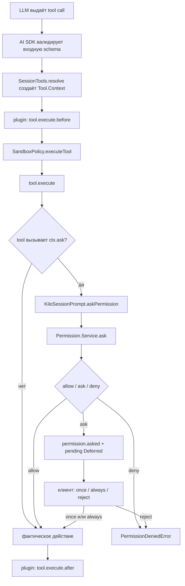

# Security / auto-approval слой для coding agent в Kilo Code

## Статус исследования

- Снимок репозитория: ветка `main`, commit `785b0bcdf7ac765dd29016cc7e8f25f66dc473c1` от 2026-09-02.
- Метод: статический разбор текущего кода, тестов и недавней git-истории.
- Scope: архитектура tool execution, permissions, auto-approve и sandbox. Реализация не выполнялась.
- В репозитории уже были пользовательские изменения в двух GIF-файлах документации; они не затрагивались.

## Краткий вывод

В Kilo нет одного монолитного «security middleware». Сейчас безопасность действия складывается из двух независимых слоёв:

1. `Permission.Service` принимает семантическое решение `allow | ask | deny` по permission key и patterns.
2. `SandboxPolicy` ограничивает среду фактического выполнения: записи, сеть, environment и дочерние процессы.

Главная архитектурная особенность: авторитетное решение централизовано в `Permission.Service`, но описание действия для этого решения децентрализовано. Каждый tool сам вызывает `ctx.ask(...)` и сам формирует `permission`, `patterns`, `metadata` и `always`. Общий executor не вычисляет permissions автоматически.

Из этого следуют три важных ограничения:

- middleware, слушающий только `permission.asked`, не видит уже автоматически разрешённые вызовы;
- interceptor только перед `tool.execute` видит полные аргументы tool call, но ещё не видит каноническую семантическую декомпозицию действия, например отдельные shell subcommands и external directories;
- interceptor внутри `Permission.ask` видит все решения для реально заявленных permissions, включая auto-allowed, но не может защитить tool, который вообще не вызвал `ctx.ask`.

Отдельного risk classifier или gatekeeper в текущем коде не найдено. `PermissionProvenance.classify` — это классификация происхождения уже принятого решения для UI и аудита, а не security classifier.

Наиболее разумное направление для hackathon MVP — серверный decision interceptor в permission pipeline с переносимым чистым decision core и тонким Kilo adapter. Если требуется контроль каждого tool call, а не только существующих permission checks, следующий уровень — двухступенчатый gate: общий tool preflight плюс авторитетное решение на уровне `Permission.ask`.

## 1. Текущий путь от tool call до выполнения

### 1.1. Основной путь встроенного tool



Ключевые участки:

- [`SessionTools.resolve`](packages/opencode/src/session/tools.ts#L70) строит runtime tool map и `Tool.Context`.
- Общая обёртка вызывает `tool.execute.before`, затем запускает `item.execute(args, ctx)` через [`SandboxPolicy.executeTool`](packages/opencode/src/session/tools.ts#L178-L211).
- [`Tool.define`](packages/opencode/src/tool/tool.ts#L100-L149) валидирует schema, добавляет span и truncation, но не делает permission check.
- `ctx.ask` передаёт запрос в [`KiloSessionPrompt.askPermission`](packages/opencode/src/session/tools.ts#L96-L165), который перечитывает текущие agent/session rules, собирает hard rules и вызывает `Permission.Service.ask`.
- Само действие выполняется только после успешного возврата из всех `ctx.ask`, которые решил вызвать tool.

Следствие: `Permission.Service` авторитетен для заявленных permission checks, но полнота покрытия зависит от дисциплины реализации tools.

### 1.2. Что именно передаёт tool в permission layer

Базовый контракт запроса содержит:

- `permission`: тип capability, например `bash`, `edit`, `read`, `external_directory` или имя MCP tool;
- `patterns`: конкретные цели, команды, пути или операции;
- `metadata`: нестрого типизированный контекст для UI и специальных guards;
- `always`: patterns, которые можно сохранить при ответе `always`;
- `tool`: correlation с `messageID` и `callID`.

Схема находится в [`packages/schema/src/v1/permission.ts`](packages/schema/src/v1/permission.ts#L16-L69). `metadata` имеет тип `Record<string, unknown>`, поэтому полнота и форма контекста отличаются между tools.

Примеры декомпозиции:

- file tools сначала проверяют `external_directory`, затем `read` или `edit`;
- shell парсит command tree, выделяет subcommand patterns и внешние директории; непарсибельные фрагменты добавляются как отдельные patterns и не проходят молча ([`shell.ts`](packages/opencode/src/tool/shell.ts#L280-L324), [`shell.ts`](packages/opencode/src/tool/shell.ts#L412-L448));
- MCP tool использует собственное имя permission и pattern `*`;
- `apply_patch` собирает список затронутых путей в один permission request;
- `task` запрашивает permission по имени subagent и затем наследует ограничения в child session.

Именно tool-specific parsing сейчас содержит значительную часть security semantics. Дублировать его во внешнем classifier нежелательно.

### 1.3. Не все исполнения проходят через один и тот же wrapper

Основной LLM tool path централизован в `SessionTools`, но существуют особые пути:

- workflow task исполняет `TaskTool.execute` напрямую из [`session/prompt.ts`](packages/opencode/src/session/prompt.ts#L403-L550);
- prompt file attachments вызывают `read.execute` напрямую, хотя создают полноценный `ctx.ask` ([`session/prompt.ts`](packages/opencode/src/session/prompt.ts#L1072-L1104));
- doom-loop guard вызывает `Permission.ask` напрямую из [`session/processor.ts`](packages/opencode/src/session/processor.ts#L483-L510);
- MCP resource helper tools собраны вручную в `SessionTools`; они вызывают `ctx.ask`, но не обёрнуты в общий `executeTool`. При restricted network они вообще не регистрируются;
- code mode исполняет вложенные MCP calls, для каждого повторяя plugin hooks, `ctx.ask` и `SandboxPolicy.executeMcp` ([`code-mode.ts`](packages/opencode/src/tool/code-mode.ts#L136-L197)).

Поэтому hook только в общем `SessionTools` executor требует явного аудита этих исключений.

## 2. Как принимается permission decision

### 2.1. Правила и порядок применения

`Permission.evaluate` объединяет rulesets и выбирает последний подходящий rule через wildcard matching; если совпадения нет, результат — `ask` ([`permission/index.ts`](packages/opencode/src/permission/index.ts#L102-L112)). Порядок rules — часть семантики.

Kilo добавляет поверх базовой модели:

- agent rules;
- global/project config rules;
- session rules;
- in-memory и сохранённые approvals;
- hard rules для read-only режимов;
- специальные protections для config paths, skill-shell и sandbox escalation.

Фактический приоритет в [`resolve`](packages/opencode/src/permission/index.ts#L115-L135):

1. базовый `deny` терминален;
2. сохранённый/session `deny` также терминален;
3. базовый `ask` может быть повышен в `allow` только покрывающим saved rule;
4. saved/session `allow` может подтвердить базовый `allow`;
5. иначе остаётся базовое решение.

Затем [`Permission.ask`](packages/opencode/src/permission/index.ts#L187-L284) применяет дополнительные guards:

1. hard-rules veto для Ask/Plan/Architect;
2. обычный `deny`;
3. обязательный manual prompt для `skillShell` и `sandboxEscalation`;
4. config-path protection;
5. auto-allow или переход в pending ask.

Это хороший фундамент для нового слоя: уже есть понятие неотменяемых запретов и manual-only действий.

### 2.2. Default posture

У build agent базовый default — `"*": "allow"`; явно спрашиваются или запрещаются отдельные категории: doom loop, внешние директории, `.env`, некоторые human/plan tools и Kilo-specific operations ([`agent.ts`](packages/opencode/src/agent/agent.ts#L131-L184)).

Значит, listener на `permission.asked` наблюдает не все действия агента, а только те, для которых текущий ruleset уже решил `ask` или специальные guards принудительно создали prompt.

### 2.3. Ручной ответ и сохранение решения

Ответы:

- `once` — продолжить текущий pending call;
- `always` — продолжить и сохранить разрешённые patterns в global config;
- `reject` — отклонить запрос и остальные pending requests той же session.

Для `skillShell` и `sandboxEscalation` сервер принимает approval только с `interactive: true`; machine auto-approver не может выдать себя за человека ([`permission/index.ts`](packages/opencode/src/permission/index.ts#L286-L340)).

`saveAlwaysRules` позволяет отдельно сохранить выбранные allow/deny patterns, а `allowEverything` добавляет broad rule `* / * / allow`, но не дренирует protected, skill-shell, sandbox-escalation или hard-veto requests ([`permission/index.ts`](packages/opencode/src/permission/index.ts#L375-L458)).

## 3. Существующие auto-approve механизмы

Механизмы неоднородны и отличаются scope, persistence и поведением в разных клиентах.

| Механизм | Где живёт | Scope и persistence | Что реально делает | Ограничение |
|---|---|---|---|---|
| Config rules | CLI backend + global/project config | Между запусками | `allow/ask/deny` по permission/pattern | Статические rules, не risk classification |
| Manual `always` | `Permission.reply` | Global config | Сохраняет выбранные allow patterns | Не работает для protected/manual-only requests |
| `allowEverything` | Backend | Global либо session | Добавляет `*/* allow`, дренирует покрытые pending | Hard deny и manual-only guards остаются |
| VS Code runtime toggle | Extension | VS Code setting, не CLI config | На `permission.asked` отвечает `once` | Не видит уже auto-allowed действия; client-specific |
| TUI runtime auto | TUI process | До выхода из TUI | На `permission.asked` отвечает `once` | Не видит auto-allowed; отличается от saved `/auto-approve` |
| `kilo run --auto` | Headless client | Один run | Отвечает `once` для root и tracked child sessions | Sensitive prompts явно rejects |
| `--yolo` / `dangerously-skip-permissions` | Headless/TUI entrypoints | Один process/run | Автоматически отвечает на prompts | Название опаснее фактического поведения: server guards всё равно действуют |

Источники:

- saved global/session allow-all: [`allow-everything.ts`](packages/opencode/src/kilocode/permission/allow-everything.ts#L8-L60);
- VS Code runtime controller: [`toggle-auto-approve.ts`](packages/kilo-vscode/src/commands/toggle-auto-approve.ts#L28-L107);
- TUI runtime auto: [`sync.tsx`](packages/tui/src/context/sync.tsx#L257-L285) и отдельная saved-команда `/auto-approve` в [`app.tsx`](packages/opencode/src/kilocode/cli/cmd/tui/app.tsx#L274-L317);
- headless: [`run.ts`](packages/opencode/src/cli/cmd/run.ts#L919-L973).

### Наблюдаемая несогласованность sensitive prompts

Headless `--auto` явно rejects и `skillShell`, и `sandboxEscalation`. VS Code runtime toggle явно пропускает только `sandboxEscalation`, а TUI runtime auto безусловно отправляет `once`. Backend всё равно откажется принять non-interactive approval и оставит sensitive request pending.

По статическому коду это создаёт риск невидимого pending/stall в client auto mode, особенно для `skillShell`. Это не подтверждалось runtime-тестом в рамках исследования, поэтому следует считать отдельной integration hypothesis, а не доказанным пользовательским багом.

Для нового security layer важно не добавлять ещё один client-specific auto mode. Решение должно жить на backend и иметь одинаковую семантику для VS Code, TUI, JetBrains, ACP и headless.

## 4. Связь permission layer и sandbox

### 4.1. Это независимые, дополняющие слои

Permission отвечает на вопрос: «разрешено ли агенту намерение X над целью Y?»

Sandbox отвечает на вопрос: «какие side effects технически достижимы во время исполнения?»

`SandboxPolicy.executeTool` оборачивает весь `item.execute`, поэтому permission checks выполняются внутри sandbox context, а фактическое действие остаётся под тем же profile. Если sandbox выключен, effect запускается через `unrestricted`; если включён, backend применяет profile ([`policy.ts`](packages/opencode/src/kilocode/sandbox/policy.ts#L601-L639)).

### 4.2. Что ограничивает sandbox

Profile по умолчанию:

- разрешает запись в project/worktree и Kilo state directories;
- запрещает запись в sandbox policy/preferences, global config и `.git`;
- фильтрует чувствительные environment variables;
- применяет network mode `allow`, `deny` или proxy allowlist.

См. [`SandboxPolicy.profile`](packages/opencode/src/kilocode/sandbox/policy.ts#L228-L278).

Network layer отдельно классифицирует delegated authority:

- custom tools требуют network authority;
- host-driven tools запрещаются при активном sandbox;
- opaque built-ins требуют network authority;
- MCP считается delegated network authority и блокируется при restricted network.

См. [`kilocode/sandbox/network.ts`](packages/opencode/src/kilocode/sandbox/network.ts#L78-L105).

### 4.3. Важные ограничения sandbox

- Sandbox выключен по умолчанию ([`sandbox/config.ts`](packages/opencode/src/kilocode/sandbox/config.ts#L19-L47)).
- Windows backend отсутствует; доступны macOS Seatbelt и Linux bubblewrap ([`packages/kilo-sandbox/src/backend.ts`](packages/kilo-sandbox/src/backend.ts#L39-L49)). Для Windows-oriented hackathon demo нельзя считать sandbox гарантированным вторым барьером.
- Filesystem policy контролирует writes, но не ограничивает reads.
- In-process enforcement опирается на sandbox-aware Effect FileSystem, HttpClient и process spawner. Произвольный plugin/custom tool работает в процессе CLI и способен использовать raw Node APIs, которые не проходят через эти decorators. Следовательно, sandbox не является полноценной изоляцией всего backend process от недоверенного plugin-кода.
- Некоторые специальные direct execution paths не проходят через общий `executeTool`, хотя сохраняют permission checks или собственное confinement.

Итог: sandbox следует использовать как defense in depth и как входной сигнал для risk decision, но не как замену approval policy.

### 4.4. Sandbox escalation как готовый паттерн

Git mutation под активным sandbox — полезный образец для нового gate:

1. shell parser определяет git mutation;
2. создаётся отдельный `sandbox_escalation` request;
3. request всегда требует интерактивного человека;
4. только после manual approval конкретный effect исполняется через `executeEscalated`, временно снимая sandbox context.

Этот контракт уже связывает semantic permission, manual-only decision и узкое снятие технического ограничения ([`shell.ts`](packages/opencode/src/tool/shell.ts#L423-L448), [`shell.ts`](packages/opencode/src/tool/shell.ts#L748-L771)). Его стоит сохранять как неотменяемый guard.

## 5. Естественные interception points

| Точка | Что видит | Полнота | Плюсы | Минусы |
|---|---|---|---|---|
| `Permission.Service.ask` | Canonical permission, patterns, metadata, rulesets, session/tool correlation | Все реально заявленные asks, включая auto-allowed | Авторитетный backend, единое поведение клиентов, естественный `allow/ask/deny` | Не видит tools без `ctx.ask`; metadata неполная; raw args обычно отсутствуют |
| `Tool.Context.ask` adapter | Всё выше плюс замкнутые в executor raw args, agent/session/sandbox context | Почти все обычные tools | Хороший Kilo-specific adapter, можно нормализовать контекст до `Permission.ask` | Есть несколько вручную созданных contexts; direct `Permission.ask` bypass; custom tool может не вызвать ask |
| `SessionTools` pre-execution wrapper | Tool id, validated raw args, agent/session, sandbox state | Все обычные LLM tool calls | Ловит вызовы без permission ask; удобен для audit/shadow mode | Ещё нет tool-specific semantic decomposition; есть direct execution exceptions; риск двойной политики |
| `tool.execute.before` plugin hook | Tool id и mutable args | Большинство normal/MCP paths | Уже существует, быстрый PoC | Не является decision contract; не вызывается для всех путей; plugin живёт в том же trust domain |
| `permission.ask` plugin hook | По типам должен видеть permission и менять status | Сейчас нулевая: hook объявлен, но не вызывается | Маленький потенциальный upstreamable seam | Нужна wiring; контракт беден; опасно позволять plugin override hard deny/manual-only |
| `permission.asked` event / SDK middleware | Только pending request | Только baseline `ask` | Самый дешёвый внешний прототип; не требует core diff | Не видит auto-allow и tools без ask; races, reconnect, directory routing, несколько клиентов |
| Sandbox executor | Profile, network/tool class и сам effect | Большинство side effects через supported adapters | Сильный enforcement и defense in depth | Не знает пользовательское намерение; слишком поздно/грубо для approval UX; platform gaps |

Отдельная деталь: plugin API объявляет hook `permission.ask` в [`packages/plugin/src/index.ts`](packages/plugin/src/index.ts#L261), но в runtime-коде нет `plugin.trigger("permission.ask", ...)`. Поэтому считать его существующим gate нельзя. `tool.execute.before` вызывается, но его output позволяет менять только args, не вернуть авторитетное decision.

## 6. Реалистичные варианты интеграции

### Вариант A. Backend permission interceptor + переносимый decision core

Архитектура:

```text
Kilo Permission AskInput
        |
        v
Kilo adapter: нормализация context + baseline decision + hard flags
        |
        v
Portable DecisionEngine.evaluate(ActionContext)
        |
        v
Decision: allow | ask | deny + reason + confidence/audit data
        |
        v
Permission.Service применяет precedence и продолжает текущий lifecycle
```

Decision core не должен импортировать Kilo services. Возможный стабильный вход:

```ts
type ActionContext = {
  tool?: string
  capability: string
  targets: string[]
  metadata: Record<string, unknown>
  baseline: "allow" | "ask" | "deny"
  agent: string
  session: string
  sandbox: { enabled: boolean; networkRestricted: boolean }
  flags: { hardDeny: boolean; humanOnly: boolean; configProtected: boolean }
}
```

Decision output должен быть объяснимым и пригодным для аудита, например `decision`, `reasonCode`, `source`, опциональные `confidence` и `policyVersion`. Kilo adapter отвечает за correlation с tool part, provenance и event metadata.

Безопасный precedence:

1. existing hard deny, explicit deny и human-only guards нельзя повысить;
2. gate может понизить baseline `allow` до `ask/deny`;
3. gate может повысить baseline `ask` до `allow` только по явно разрешённой policy;
4. timeout, exception или невалидный classifier output для покрываемого действия дают `ask`, а не `allow`;
5. `sandboxEscalation`, `skillShell` и config protection остаются вне автоматического повышения;
6. decision и его причина записываются рядом с существующим approval provenance.

Оценка:

| Критерий | Оценка |
|---|---|
| Сложность MVP | Средняя |
| Качество интеграции | Высокое для существующих permission checks |
| Тестируемость | Высокая: pure engine + Permission service tests |
| Покрытие tools без ask | Нет |
| Пригодность для hackathon | Высокая |
| Перспектива upstream | Хорошая для общего interceptor contract; Kilo policy остаётся в `kilocode`/отдельном package |

Глубина изменений может быть небольшой: новый Kilo-owned module/package, один тонкий hook в shared permission path, расширение provenance/audit schema и targeted tests. Это соответствует fork policy: бизнес-логика вне shared OpenCode files, shared diff — минимальный marked call.

### Вариант B. Двухступенчатый gate: tool preflight + permission interceptor

Архитектура использует тот же portable core, но два adapter-а:

1. `SessionTools` preflight регистрирует полный raw tool call и запускает shadow/audit или coarse blocking до `item.execute`.
2. `Permission.Service.ask` принимает точное решение после tool-specific semantic parsing.

`callID` связывает preflight action с одним или несколькими permission requests. Для tools, которые не выпустили ни одного permission request, preflight может либо применить отдельную policy, либо пометить нарушение tool contract.

Преимущества:

- наблюдаемость каждого обычного LLM tool call;
- обнаружение tools без `ctx.ask`;
- raw args доступны classifier-у;
- точные shell/path/MCP patterns по-прежнему берутся из существующих tools, а не воспроизводятся отдельно.

Цена:

- нужно покрыть direct Task/read paths и вложенный code mode;
- требуется lifecycle/correlation state на session + callID;
- возможны два решения для одного действия, поэтому нужен формальный precedence;
- shared execution path меняется глубже, а upstream diff становится заметнее.

Оценка:

| Критерий | Оценка |
|---|---|
| Сложность MVP | Средне-высокая |
| Качество интеграции | Наивысшее потенциальное покрытие |
| Тестируемость | Высокая, но больше integration matrix |
| Покрытие tools без ask | Да, после закрытия direct-path inventory |
| Пригодность для hackathon | Средняя; хороша при готовом core и ограниченном tool scope |
| Перспектива upstream | Средняя; generic preflight contract upstreamable, Kilo correlation сложнее |

### Вариант C. Внешний client middleware на `permission.asked`

Это самый дешёвый демонстрационный путь: отдельный процесс или client component подписывается на events, классифицирует pending request и вызывает permission reply.

Он реалистичен только при честном ограничении scope: «автоматизируем ответы на уже возникшие prompts». Он не является полноценным security layer, потому что не видит:

- baseline/config/session auto-allow;
- broad `allowEverything`;
- tools, не вызывающие `ctx.ask`;
- действие до постановки pending request.

Дополнительная цена productionization — directory routing, reconnect/replay, несколько клиентов, headless runs и authoritative ownership pending queue.

Оценка: низкая сложность, высокая демо-пригодность, низкая полнота и слабая перспектива как основная upstream архитектура.

### Вариант D. Plugin-based gate

Текущий `tool.execute.before` подходит для telemetry или shadow classification, но не для финального решения. Объявленный `permission.ask` hook можно оживить, однако безопасный контракт должен быть ограничен:

- plugin не может override hard deny или human-only;
- ошибки plugin дают `ask`;
- определяется порядок нескольких plugins;
- решение и timeout фиксируются в audit;
- gate plugin должен быть trusted, поскольку он исполняется внутри CLI process.

После такой wiring это фактически станет разновидностью варианта A с plugin adapter. Без неё plugin-only решение недостаточно.

### Вариант E. Sandbox-centric classifier

Использовать sandbox wrapper как единственный gate нецелесообразно. Он хорошо знает технический capability class, но плохо знает семантическую цель и пользовательскую policy. Sandbox может быть enforcement backend и источником features для classifier, но не заменой permission decision.

## 7. Переносимость security logic

Вынести logic в отдельный модуль возможно и желательно. В репозитории уже есть удачный precedent — отдельный package [`@kilocode/sandbox`](packages/kilo-sandbox/package.json), а Kilo CLI содержит adapter/policy layer в `packages/opencode/src/kilocode/sandbox`.

Для security decision layer разумно разделить:

### Portable core

- нормализованный `ActionContext` без Kilo/Effect/SDK types;
- deterministic policy rules;
- optional classifier interface;
- composition и precedence;
- schema validation ответа classifier;
- reason codes, policy version и audit record;
- unit tests на decision matrix.

### Kilo adapter

- построение context из `Permission.AskInput`, agent/session rules, sandbox state и tool correlation;
- сохранение existing hard/manual-only guarantees;
- отображение decision в текущие errors/events/provenance;
- feature flag, shadow mode и timeout;
- Kilo integration tests.

Для hackathon MVP обязательный hot path лучше не делать зависимым от удалённой LLM-классификации. Сначала пригодны deterministic rules и локальный classifier interface; внешний/LLM classifier можно подключить только для неоднозначных `ask` с коротким timeout и fallback в `ask`. Иначе latency, nondeterminism, prompt injection и недоступность сети превращаются в часть permission boundary.

## 8. Архитектурные ограничения и технический долг

### 8.1. Децентрализованные permission declarations

Tools сами решают, когда и с каким контекстом вызывать `ctx.ask`. Нет registry-level декларации «этот tool обязан выпустить такие capabilities». Это главный пробел для полного gatekeeper-а.

### 8.2. Нестабильный action schema

`metadata` не типизировано по permission kind, а `patterns` имеют разные значения: shell command, glob, path, URL, query или просто `*`. Переносимый модуль должен получать нормализованный Kilo adapter context, а не напрямую трактовать произвольный `metadata`.

### 8.3. Несколько auto modes

Saved rules, session allow-all, TUI runtime auto, VS Code runtime auto и headless flags имеют разный lifecycle. Добавлять ещё один consumer events — значит увеличивать расхождение. Backend decision layer снимает большую часть этой проблемы.

### 8.4. Несколько клиентов и directory-scoped backend state

Permission и sandbox state привязаны к instance/directory и session; Agent Manager передаёт worktree directory в общий `kilo serve`. Любой внешний middleware обязан правильно маршрутизировать directory. Внутренний service adapter получает эту привязку естественно через `InstanceState`.

### 8.5. Child sessions

Task наследует permission ceilings и sandbox policy в child session. Gate state, cache и audit нельзя делать только root-session scoped. Нужны либо независимые решения по каждой session, либо явная inheritance model.

### 8.6. Config mutation и live reload

`always` и allow-all изменяют global config, а клиенты умеют дренировать pending requests. Decision cache не должен жить дольше policy/config revision и не должен молча переживать смену agent/session rules.

### 8.7. Fork/upstream pressure

`packages/opencode/src/permission/index.ts` и `session/tools.ts` — shared OpenCode paths и уже содержат заметные Kilo deltas. Для минимизации merge conflicts новая policy должна жить в Kilo-owned path или package; в shared files нужен только тонкий generic hook. Generic permission evaluator/interceptor contract имеет шанс на upstream PR, Kilo-specific classifier и UI semantics — заметно меньший.

### 8.8. Plugin/custom tool trust

Custom tools получают `ctx.ask`, но вызов не принудителен. Кроме того, plugin code исполняется внутри backend process. Security claim должен явно различать:

- контроль действий model-driven built-in tools;
- контроль delegated MCP authority;
- доверенный или недоверенный plugin code.

Полноценная защита от malicious in-process plugin требует отдельной process isolation, а не только permission classifier.

### 8.9. Platform gap sandbox

На Windows активировать текущий sandbox backend нельзя. Поэтому результаты hackathon demo на Windows должны показывать permission enforcement отдельно и не заявлять sandbox-backed containment.

## 9. Что уже можно переиспользовать

Отдельного `gatekeeper`, risk classifier или action classifier в текущем tree и доступных ветках не найдено. Полезные наработки находятся вокруг decision integrity и объяснимости:

| Период / commit | Наработка | Что переиспользовать |
|---|---|---|
| 2026-07-23…31, `073df16459`, `7f37d015ed`, `5f3b57b971`, `c56aad9d6c` | Approval/denial provenance | Reason/source model, запись в tool metadata, тесты происхождения rules |
| 2026-07-28, `a0a760e00e` | Fail-closed для непарсибельных shell commands | Принцип «unknown → ask/deny, не allow» |
| 2026-07-29, `7650d0fd09` и follow-ups | Human-only skill shell approval | Machine/human distinction через `interactive` и terminal sensitive guard |
| 2026-08-17, `86af8dd7c7`, `a066d0f983` | Sandbox git escalation | Узкий manual-only escape hatch вокруг конкретного effect |
| 2026-08-18, `d4f3a3a9e6` | Hard read-only modes | Hard rules, которые broad allow не может обойти |
| 2026-08-27, `62998965e9` | Dedupe plan-mode rules | Стабильная сборка rulesets и корректный winning rule |
| 2026-08-07, `4e36297668` | Live sandbox settings | Config revision/snapshot discipline для long-lived sessions |
| 2026-07-29 и далее, `92076e7071` | Saved auto-approve UX | Существующие server endpoints и client surfaces |

Наиболее подходящие существующие test seams:

- `packages/opencode/test/permission/next.test.ts` — базовая ruleset semantics;
- `packages/opencode/test/kilocode/ask-agent-permissions.test.ts` — Kilo ask assembly;
- `packages/opencode/test/kilocode/permission/provenance.test.ts` и `deny-provenance.test.ts`;
- `packages/opencode/test/kilocode/permission/skill-shell.test.ts`;
- `packages/opencode/test/kilocode/server/permission-allow-everything.test.ts`;
- `packages/opencode/test/kilocode/agent-permission-overrides.test.ts`;
- `packages/opencode/test/kilocode/sandbox/session-tools.test.ts`;
- `packages/opencode/test/kilocode/tool/shell-unparsed.test.ts`.

## 10. Рекомендации

### Направление 1 — рекомендуемое для hackathon MVP

Сделать переносимый `DecisionEngine` и Kilo adapter на backend в авторитетном permission path.

Почему:

- одинаково работает для всех клиентов и headless;
- видит не только pending prompts, но и auto-allowed outcome каждого существующего `ctx.ask`;
- использует готовую tool-specific декомпозицию shell/path/MCP;
- естественно сохраняет hard deny, manual-only и config protections;
- легко тестируется как pure matrix плюс существующие Permission integration tests;
- требует минимального shared diff и оставляет Kilo policy переносимой;
- generic interceptor interface можно позже предложить upstream независимо от конкретной policy.

Для MVP следует ограничить security claim: слой контролирует все существующие permission requests, но ещё не доказывает, что каждый tool call обязательно создаёт permission request.

### Направление 2 — если цель включает каждый tool call

Добавить к тому же core shadow/preflight adapter в `SessionTools`, затем закрыть direct execution inventory и ввести correlation по `callID`.

Почему:

- обнаруживает tools без `ctx.ask`;
- даёт classifier-у raw args;
- сохраняет точность существующих semantic checks на permission stage;
- даёт путь от hackathon prototype к полноценному action gate.

Для hackathon это разумно только в ограниченном scope, например shell + edit/write/apply_patch + MCP, иначе объём integration matrix может вытеснить сам security experiment.

### Что не рекомендуется как основная архитектура

- client-side event middleware — годится для demo approval bot, но не для security boundary;
- новый параллельный auto-mode в одном UI — усилит существующее расхождение клиентов;
- sandbox-only gate — неверный уровень абстракции;
- plugin-only gate без backend precedence — неавторитетен и смешивает security policy с in-process plugin trust.

## 11. Критерий выбора между двумя направлениями

Выбор сводится к формулировке гарантии:

- Если гарантия MVP: «безопаснее автоматически отвечать на существующие Kilo permission decisions», достаточно направления 1.
- Если гарантия: «ни один model-issued tool call не исполняется без security evaluation», нужно направление 2 и отдельный audit всех direct/custom paths.

С учётом hackathon scope, текущей зрелости Permission service и fork constraints разумно начать с направления 1, сразу заложив `ActionContext`, audit и `callID`, совместимые с последующим двухступенчатым gate.
